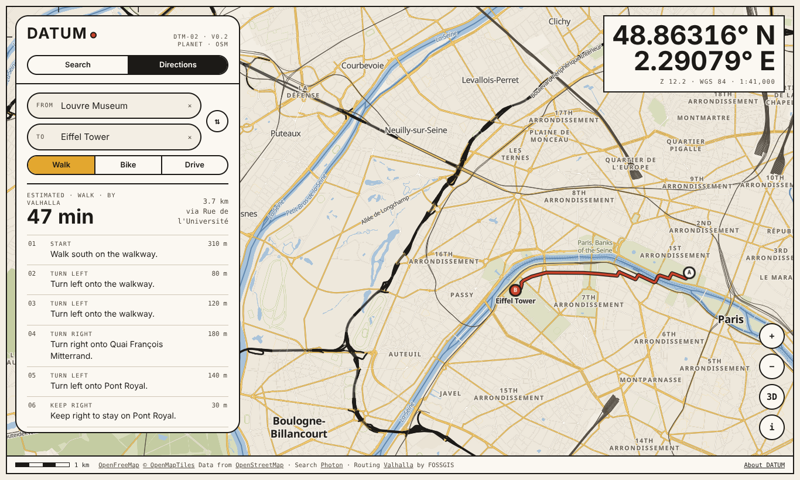
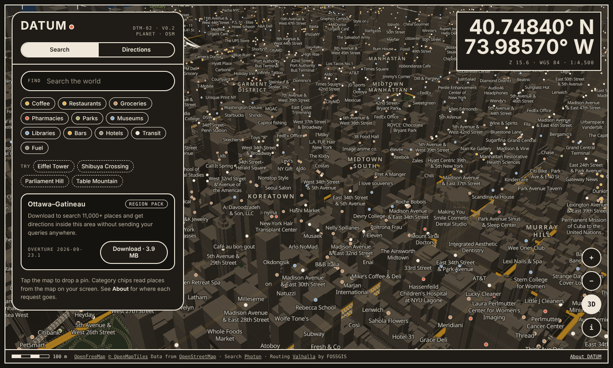
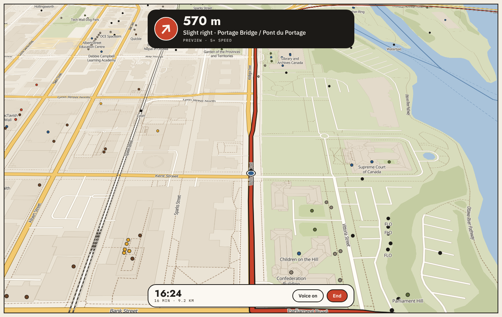

# DATUM Maps

A free, open map of the world. Search places, get walking, cycling and driving
directions with turn-by-turn navigation, and keep **any part of the world** on your
device to use with no connection. No account, no ads, no analytics.

`DTM-03 · v0.3 · build 2026-11-20` — an AI² Lab project by AKA IND Technologies Inc.



| Globe | Region pack on a phone | 3D buildings |
|---|---|---|
|  |  |  |



## What works in v0.3

| Feature | How it works | Where the request goes |
|---|---|---|
| World map (globe at low zoom, 3D buildings) | OpenMapTiles vector tiles rendered with MapLibre GL JS 5.24.0 | OpenFreeMap, or the device for downloaded areas |
| Offline areas, anywhere on Earth | The Offline tab lists 242 countries and territories, 4,535 states and provinces and 7,324 cities, and can also download whatever is on screen. Tiles go into IndexedDB and are served back to the map through a `datum://` protocol, stored copy first | OpenFreeMap, once, at download |
| On-device directions (walk, bike, drive) | A road graph is built **in the browser** from the downloaded tiles, then searched with an edge-based A* with turn and junction costs, alternatives and avoid options (`js/graph.js`, `js/router.js`) | Nothing sent |
| On-device search | Places, streets, parks and water names collected from the same tiles (`js/search.js`) | Nothing sent |
| Turn-by-turn navigation | Follows your position along the route, speaks each turn, re-routes when you leave the route; "Preview drive" plays a route back without GPS (`js/nav.js`) | Position stays in the page |
| Emergency (SOS) tab | Your coordinates in large type, the country's emergency number, and the nearest hospitals, clinics, pharmacies, police, fire stations, shelters and fuel with one-tap directions. Inside a downloaded area it all works with no connection; elsewhere it asks Photon | Nothing sent inside a downloaded area. "Share position" uses the phone's own share sheet or SMS |
| Open in Google Maps / Apple Maps | Links on every place card and route hand the place or trip to another maps app | Opens that app; it needs its own connection |
| Typical traffic | A time-of-day and day-of-week congestion model by road type, applied to on-device driving times. A model, not a feed | Nothing sent |
| Live traffic (optional) | With your own TomTom key: traffic-aware driving routes and a flow and incident overlay | TomTom, only once a key is saved |
| Search anywhere | Photon geocoder, biased to the map centre; falls back to downloaded areas and the city catalog when offline | Photon (komoot public server) |
| Directions anywhere | Valhalla routing with turn-by-turn steps and alternatives, when the trip is not inside one downloaded area | Valhalla on the FOSSGIS public server |
| World view in the Equal Earth projection | Zoomed out, the world is drawn with d3-geo in Equal Earth, the area-true projection the UN General Assembly backed on 4 September 2026 | DATUM's own site (`data/world.json`) |
| Installable, starts offline | Web app manifest and a service worker that keeps the app shell | DATUM's own site |
| Ottawa–Gatineau region pack (3.9 MB) | 11,487 places with phone and web details from Overture; routed by the same on-device router | Nothing sent after download |

## Run it

It is a static site: `index.html`, the `js/` engine, `data/`, `packs/` and a service
worker. `vercel.json` sets cache and security headers for Vercel; any static host works.

```sh
npm start          # python3 -m http.server 8080
npm test           # engine tests, Node 20+, no dependencies
```

Offline storage, the service worker and geolocation need `https://` or `localhost`.

## Offline areas

An area is stored at one of three levels, chosen from its size:

| Level | Top zoom | Limit | What works offline |
|---|---|---|---|
| Streets | 14 | 2,500 tiles (a large city) | Map, search, and walk, bike and drive directions |
| Roads | 12 | 6,000 tiles (a region or small country) | Map to town level, driving directions on through roads |
| Map | ≤ 10 | 6,000 tiles | Map only. The largest countries and the whole world |

Measured on Ottawa (catalog entry, 38 km across): 762 tiles, 25 MB stored, graph of
347,000 road segments; download and build took 28 seconds on a fast connection, and a
10 km drive with two alternatives is found in under a second.

**How the road graph is built.** Tiles carry merged, simplified lines clipped at tile
edges, so `js/graph.js` clips each line to its tile, finds the junctions again (shared
vertices, T-junctions whose vertex was simplified away, crossings on the same layer and
bridge/tunnel state), stitches the pieces across tile borders, attaches names from the
separate `transportation_name` layer and contracts degree-2 nodes.

**How good are the routes.** Checked against Valhalla on random trips (device time ÷
Valhalla time, median): Ottawa streets level 0.96 drive, 1.01 walk, 0.95 bike; Ottawa
region at roads level 1.05 drive; Amsterdam 0.90 drive, 0.93 bike. Distances agree to
within 1% at the median.

**Known limits of on-device routing.** The tiles do not carry speed limits, turn
restrictions, roundabout tags, or access rules for one kind of vehicle (bus-only streets,
`motor_vehicle=no`), so speeds are set by road type and a route can occasionally use a
street a car may not enter. Ferries are kept for driving only where they land on roads
at both ends. Roads-level areas have no street names for minor streets.

**Size of the world.** The public tile server is donation-funded, so downloads are
capped per area rather than offering a whole continent at street level. Hosting our own
tiles (OpenFreeMap publishes the full planet) would lift that.

## Emergency use


The point of the SOS tab is that it keeps working when the network does not, so
**download the area you live or travel in before you need it** (SOS → "Download 25 km
around", or the Offline tab). Then, with no signal at all, the device still has the map,
your GPS position, the nearest emergency places and routes to them.

What it cannot do: it does not contact emergency services for you, and it does not send
your position anywhere. "Call" opens the phone dialler; "Share position" and "Text it"
hand a message to the phone's own apps, which need a mobile signal. Emergency numbers are
built in for about 50 countries; elsewhere it shows 112, which mobile networks in most
countries connect to the local service. Places come from OpenStreetMap and can be
missing or out of date.

## Traffic

There is no free, keyless live traffic feed for the whole world, so DATUM is explicit
about what it shows:

- **Typical traffic** (default for driving on-device): a rush-hour curve by time and
  weekday scaled by road type and by whether the road runs through a built-up area. Pick
  a departure time under Directions → Options. It is an estimate.
- **Live traffic**: paste a TomTom API key under Directions → Options. Driving routes
  then come from the TomTom Routing API with `traffic=true`, and the map gains flow and
  incident tiles. The key is stored in the browser's `localStorage`; restrict it to your
  domain in the TomTom dashboard. **This path was written from TomTom's documentation and
  has not been run against a real key yet.**
- The router also accepts per-road live speed ratios (`Router.live`), ready for a feed
  that is matched to the graph.

## Services and swapping them

Every external service is in the `CONFIG` block at the top of the script in
`index.html` (`tiles`, `glyphs`, `search`, `route`, `traffic`).

- **OpenFreeMap** states it is free for any use, with no API keys and no limits on
  map views; attribution is required.
- **Photon** (komoot) public server: free within reasonable use; heavy use is
  throttled or banned; no availability guarantee.
- **Valhalla** on the FOSSGIS server: a community-run public instance. Read the
  FOSSGIS terms at <https://www.fossgis.de/arbeitsgruppen/osm-server/nutzungsbedingungen/>
  before sending real traffic.

All three are open source (OpenFreeMap, Photon, Valhalla) and can be self-hosted.
**Before a public launch with real traffic, point `tiles`, `search` and `route` at our
own instances**; the public servers are not meant to carry another product's load.

## Download catalog

`data/regions.json` (677 KB, 280 KB gzipped, loaded when the Offline tab opens) is built
from Natural Earth with `tools/build_regions.py`; the steps are in the file's header.
Entries follow Natural Earth's list of countries and territories; names and outlines do
not imply endorsement.

## Region packs

A pack is a quantized, delta-encoded JSON extract of Overture Maps data for one
bounding box: a routable road graph (`roads.json`), land, water and neighbourhood
names (`areas.json`) and places (`places.json`).

Build one with `tools/build_pack.py`:

```sh
pip install overturemaps shapely
B=-75.74,45.38,-75.65,45.445
for t in segment place water land_use land division; do
  overturemaps download --bbox=$B -f geojson --type=$t -o raw/$t.geojson
done
python3 tools/build_pack.py        # edit BBOX / RELEASE at the top first; writes pack/*.json
```

Sidewalks are mapped as unnamed footways; the builder gives each one the name of
the parallel street within 30 m (flag 256), so walking directions read
"Bank Street" instead of "footpath". On-device routing snaps endpoints to the
largest strongly connected component for each travel mode, so a route always
exists inside a pack.

Pack roads carry posted speed limits, which the router uses in place of the road-type
defaults. Turn restrictions and time-based access rules are not applied.

## World view

`data/world.json` (152 KB, 50 KB gzipped) is built from Natural Earth, which is in the
public domain, with `tools/build_world.py`:

```sh
pip install shapely
B=https://raw.githubusercontent.com/nvkelso/natural-earth-vector/master/geojson
mkdir -p ne && for f in ne_50m_land ne_50m_admin_0_boundary_lines_land ne_50m_lakes ne_110m_admin_0_countries; do
  curl -sL -o ne/$f.geojson $B/$f.geojson
done
python3 tools/build_world.py ne data/world.json
```

Borders are Natural Earth's de facto lines. Disputed, indefinite and line-of-control
segments are drawn dashed, and countries are not coloured individually. Two de facto
entities that OpenStreetMap does not map as countries (Somaliland, Northern Cyprus) are
left unlabelled for consistency with the rest of the map. The UN's own map images are
not used: the UN website licenses them for personal, non-commercial use only.

## Android app and Android Auto

`android/` builds DATUM for Android, package `ca.akaind.datum` (Android 8 and up).

- **On the phone** it is this web app, bundled in the APK and served to a WebView from
  `https://appassets.androidplatform.net`, a secure origin, so region packs and "locate
  me" work as in a browser. MapLibre GL JS, d3 and the fonts are bundled too
  (`tools/vendor_web.py`, checked against cdnjs's SRI hashes), so the app opens with no
  network and makes no requests to a CDN or to Google. Tiles, search and routing use the
  same servers as the web app. The build copies `index.html`, `data/` and `packs/` from
  the repository root, so the app always ships the current site.
- **In the car** it is a native Android Auto navigation app built on the Car App
  Library 1.7.0. The car screen draws DATUM's own map style (exported from the web app
  by `tools/export_car_style.py`) with MapLibre Native 13.6.1. It has search and five
  nearby categories (gas, EV charging, parking, food, coffee), read from the map tiles
  already on the phone with Photon as the fallback. Route preview offers up to three
  routes from Valhalla. Guidance is turn by turn, with spoken instructions on the
  navigation audio stream, rerouting when the car leaves the route, and arrival. Trip
  details go to the instrument cluster or head-up display where the car has one.
  "Navigate to…" from Assistant and other apps opens DATUM directly. Location comes
  from Android's own location service, with no Google Play services.

Build (JDK 17 or newer, Android SDK 36):

```sh
cd android
./gradlew testDebugUnitTest      # routing, guidance and car screen tests (Robolectric)
./gradlew assembleDebug          # app/build/outputs/apk/debug/app-debug.apk
```

Release builds are signed with the upload key named in `android/keystore.properties`
(or the file `DATUM_KEYSTORE_PROPERTIES` points to). Both that file and the key are
git-ignored and must never be committed. Then:

```sh
./gradlew assembleRelease   # APKs to sideload: one per CPU type plus a universal one
./gradlew bundleRelease     # AAB for Google Play (run on its own)
```

Most phones, a Galaxy Z Fold included, take `app-arm64-v8a-release.apk`. Enrol the app in
Play App Signing so the key in `keystore.properties` is only the upload key: Google
holds the app signing key, and a lost upload key can be reset from the Play Console.

Trying it in a car: Android Auto only lists apps installed from Google Play unless you
turn on Android Auto's developer settings (tap *Version* ten times) and enable *Unknown
sources*. On a computer, Google's Desktop Head Unit stands in for the car. Once
guidance has started, `adb shell dumpsys activity service
ca.akaind.datum/.car.DatumCarAppService AUTO_DRIVE` drives the route for you.

## Attribution (required wherever the map is shown)

- Map: OpenFreeMap © OpenMapTiles. Data from © OpenStreetMap contributors (ODbL 1.0).
- Search: Photon by komoot, OpenStreetMap data.
- Routing: Valhalla, served by FOSSGIS e.V., OpenStreetMap data.
- World view: Natural Earth (public domain), drawn with d3-geo (ISC). Equal Earth projection by Šavrič, Patterson and Jenny (2018).
- Offline areas: the same OpenFreeMap tiles, © OpenStreetMap contributors (ODbL 1.0). Download catalog: Natural Earth (public domain).
- Live traffic, when a key is set: © TomTom.
- Region packs: Overture Maps Foundation (release 2026-09-23.1). Roads, buildings,
  land and water © OpenStreetMap contributors (ODbL 1.0). Places under
  CDLA-Permissive-2.0, including Foursquare Open Source Places (Apache-2.0) and
  AllThePlaces (CC0).

## Licences

- Code: GNU AGPL-3.0 (see `LICENSE`).
- Region pack files: a derivative database of ODbL data, available under ODbL 1.0.
- The Canada address points in Overture (source `ca/countrywide`) are tagged
  `LicenseRef-Proprietary` in the row data, while Overture's documentation lists the
  source as openly licensed. They are left out of packs until that is resolved.
